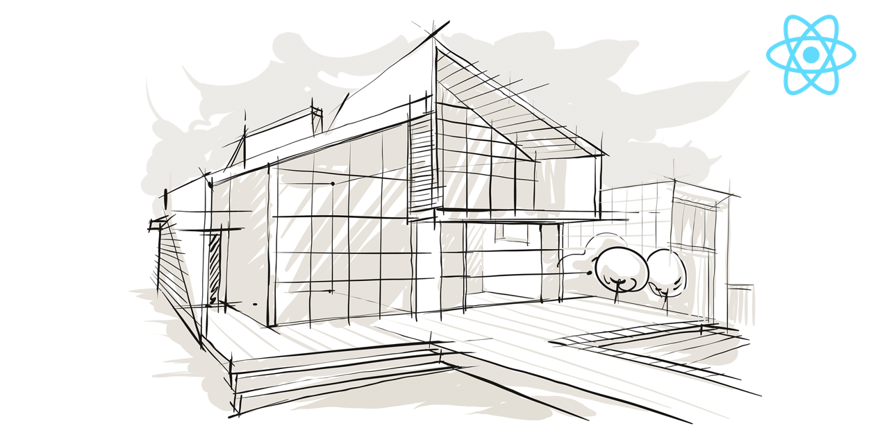

# **4Dev React - Enquetes para Programadores**

---

## [**Link para o curso completo**](https://www.udemy.com/course/)

Essa sistema faz parte do treinamento do professor Rodrigo Manguinho (Mango) na Udemy.

O objetivo do treinamento é mostrar como criar um sistema em ReactJs com uma arquitetura bem definida e desacoplada, utilizando TDD (programação orientada a testes) como metodologia de trabalho, Clean Architecture para fazer a distribuição de responsabilidades em camadas, sempre seguindo os princípios do SOLID, DRY, YAGNI, KISS e aplicando Design Patterns para resolver alguns problemas comuns.

## [**Link para a documentação da API**](http://fordevs.herokuapp.com/api-docs)

> ## Princípios

* Single Responsibility Principle (SRP)
* Open Closed Principle (OCP)
* Liskov Substitution Principle (LSP)
* Interface Segregation Principle (ISP)
* Dependency Inversion Principle (DIP)
* Don't Repeat Yourself (DRY)
* You Aren't Gonna Need It (YAGNI)
* Keep It Simple, Silly (KISS)
* Composition Over Inheritance
* Small Commits

> ## Design Patterns

* Factory
* Adapter
* Composite
* Decorator
* Dependency Injection
* Abstract Server
* Composition Root

> ## Metodologias e Designs

* TDD
* Clean Architecture
* DDD
* Reactive Programming
* Conventional Commits
* GitFlow
* Modular Design
* Dependency Diagrams
* Use Cases
* Continuous Integration
* Continuous Delivery
* Continuous Deployment

> ## Bibliotecas e Ferramentas

* React
* Typescript
* Git
* Jest
* Axios
* Webpack
* SASS
* NPM
* Travis CI
* Faker
* Coveralls
* React Hooks
* React Router
* Husky
* Lint Staged
* Eslint
* Standard Javascript Style

> ## Features do React

* React Testing Library
* React Router
* UseState
* UseContext
* UseEffect
* UseHistory
* Memo
* Functional Components

> ## Features do Git

* Alias
* Log Personalizado
* Branch
* Reset
* Amend
* Tag
* Tag Anotada
* Stash
* Rebase
* Merge
* Add
* Commit
* Push
* Pull
* Shortlog
* Status

> ## Features do Typescript

* POO Avançado
* Interface
* Type Alias
* Utility Types
* Modularização de Paths
* Build
* Deploy
* Generics

> ## Features de Testes

* Testes Unitários
* Testes de Integração
* Testes e2e
* Cobertura de Testes
* Test Doubles
* Mocks
* Stubs
* Spies
* Fakes
* Dummies